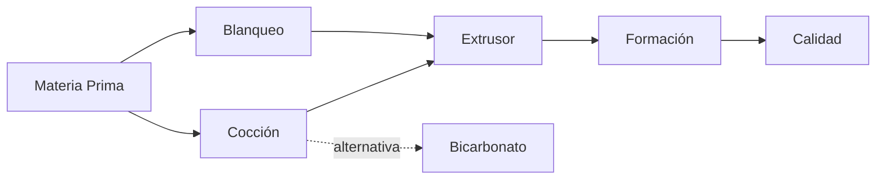

# Tech Spec: Fase 1 — Diseño del Proceso

## Arquitectura del Proceso

```
Materia Prima ──► Cocción Alcalina ──► Lavado ──► Blanqueo ──► Refinado ──► Formación ──► Secado/Prensado
                       │                   │           │             │              │
                   [quimica]           [quimica]   [quimica]    [extrusor]      [hoja]
                       │                                              │
                  [fibra]                                       [investigacion]
```

## Plan de Implementación

### Paso 1: Especificación de Materia Prima
**Agente**: `fibra`

Entregables:
- `especificaciones/MATERIA_PRIMA.md`
  - Tipo de tela recomendado (tocuyo crudo 24/1 vs alternativas)
  - Criterios de aceptación (composición, gramaje, color, ancho)
  - Pruebas de verificación (quemado, composición)
  - Proveedores locales identificados (La Paz/El Alto)
  - Costo estimado por metro y por lote de prueba
  - Recomendación de cantidad inicial (metros para pruebas)

### Paso 2: Formulación Química
**Agente**: `quimica`

Entregables:
- `especificaciones/COCCION_ALCALINA.md`
  - Reactivo: soda ash vs bicarbonato (con tabla comparativa)
  - Concentración óptima (% sobre peso seco de fibra)
  - Relación baño (licor : fibra)
  - Temperatura y tiempo de cocción
  - Control de pH: valores inicial, durante y final
  - Neutralización y lavado posterior

- `especificaciones/BLANQUEO.md`
  - Concentración de H₂O₂ 30 vol (volumen sobre peso de fibra)
  - Temperatura y tiempo óptimos
  - pH de trabajo y estabilizador (Na₂SiO₃)
  - Secuencia: antes o después del refinado
  - Enjuague y neutralización final

### Paso 3: Especificación del Extrusor
**Agente**: `extrusor`

Entregables:
- `especificaciones/EXTRUSOR.md`
  - Diámetro de tornillo, relación L/D, configuración (co-rotativo)
  - Perfil de tornillo detallado: zonas, elementos, secuencia
  - Parámetros operativos: velocidad, temperatura por zona, torque, presión
  - Tiempo de residencia esperado y distribución (RTD)
  - Consistencia de fibra en el barril (%)
  - Sistema de inyección de químicos (puntos, caudales)
  - Desgasificación (venteo)
  - Materiales de construcción recomendados
  - Fabricantes identificados (europeos y chinos) con rangos de precio
  - Recomendación para escala laboratorio vs piloto

### Paso 4: Protocolo de Formación de Hoja
**Agente**: `hoja`

Entregables:
- `especificaciones/FORMACION_HOJA.md`
  - Diseño de molde y cubeta para laboratorio
  - Especificaciones de tela de formación
  - Protocolo paso a paso: preparación de pulpa, formación, drenaje
  - Prensado: presión, tiempo, configuración (frío/caliente)
  - Secado: temperatura, tiempo, método (plancha, estufa, aire)
  - Gramaje objetivo y control de espesor
  - Almacenamiento y acondicionamiento de la hoja

### Paso 5: Criterios y Métodos de Calidad
**Agente**: `investigacion` + `hoja`

Entregables:
- `especificaciones/CALIDAD.md`
  - Gramaje (g/m²) — ISO 536
  - Espesor (μm) — ISO 534
  - Tracción (kN/m) — ISO 1924
  - Plegado (MIT, # dobleces) — ISO 5626
  - Desgarro (mN) — ISO 1974
  - Blancura (% ISO) — ISO 2470
  - Opacidad (%) — ISO 2471
  - Cenizas (%) para verificar carga mineral
  - Valores objetivo alineados con papel moneda comercial

## Herramientas y Métodos

### Agentes OpenClaw
Cada paso usa el agente especializado correspondiente:
```bash
./.openclaw-run.sh agent --local --agent <nombre> \
  --message "genera <entregable> siguiendo la especificación en specs/fase-01-diseno/PRODUCT.md"
```

### Investigación Web
El agente `investigacion` usará `web_search` para:
- Precios actuales de equipos
- Proveedores en Bolivia/Perú
- Estándares internacionales
- Patentes y publicaciones técnicas

### Validación Cruzada
Cada entregable será revisado por otro agente para verificar consistencia:
- `fibra` revisa especificación de `quimica` (¿la materia prima soporta la receta?)
- `quimica` revisa especificación de `extrusor` (¿los químicos son compatibles con los materiales?)
- `hoja` revisa especificación de `calidad` (¿los criterios son alcanzables?)
- `investigacion` revisa todo contra estándares reales

## Dependencias



1. **Materia Prima** debe definirse primero (todo lo demás depende de la fibra)
2. **Cocción** y **Blanqueo** pueden hacerse en paralelo (ambos dependen de MP)
3. **Extrusor** depende de ambos procesos químicos
4. **Formación** depende del extrusor
5. **Calidad** es el último paso, integra todo lo anterior

## Riesgos

| Riesgo | Impacto | Mitigación |
|--------|---------|------------|
| No encontrar tocuyo 24/1 local | Alto | Alternativa: 20/1 o pedido online |
| Costo de extrusor muy alto | Alto | Empezar con proceso manual (olla + molino) |
| Receta química no reproducible | Medio | Documentar cantidades exactas y procedencia |
| Calidad de hoja insuficiente | Medio | Iterar sobre parámetros antes de escalar |
| Proveedores no responden | Bajo | Tener 3+ opciones por categoría |

## Cronograma Estimado

| Paso | Agente | Tiempo estimado |
|------|--------|----------------|
| 1. Materia Prima | `fibra` | 1 turno |
| 2. Cocción Alcalina | `quimica` | 1 turno |
| 3. Blanqueo | `quimica` | 1 turno |
| 4. Extrusor | `extrusor` | 2 turnos |
| 5. Formación de Hoja | `hoja` | 1 turno |
| 6. Calidad | `investigacion` + `hoja` | 1 turno |
| 7. Validación cruzada | Todos | 1 turno |

**Total estimado**: 8 turnos de agente
